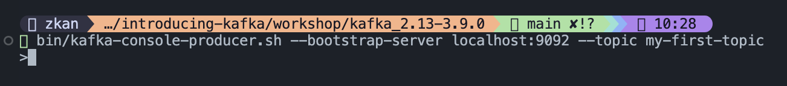
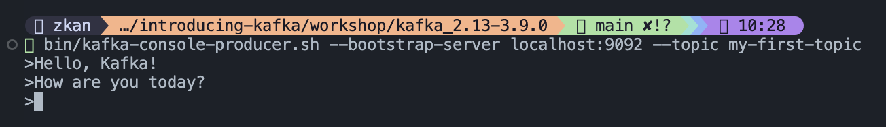

# Sending your First Message

ตอนนี้เรามี Kafka ที่พร้อมใช้งานแล้ว ในหัวข้อนี้เราจะมาลองมาส่งและรับ message กัน

## Working with Topics

### Creating a Topic

ก่อนที่เราจะส่ง message ได้ เราจำเป็นต้องมี topic ก่อน โดยเราจะสร้าง topic ชื่อ `my-first-topic` ผ่านสคริป `kafka-topics.sh` ตามคำสั่งด้านล่างนี้

```bash
bin/kafka-topics.sh --bootstrap-server localhost:9092 --create --topic my-first-topic --replication-factor 1 --partitions 1
```

ค่า `replication-factor` จะเป็นการบอกว่าเราจะมีจำนวน replica ของ message เท่าไหร่ ในกรณีเราเซตค่าเป็น 1 จะหมายความว่าไม่ต้องมี replica เลย ในทางปฏิบัติเราควรจะมีค่า replication factor ประมาณ 2-3 เพื่อให้มี data availability มากขึ้น

ค่า `partitions` เป็นการบอกจำนวน partitions ที่ topic นั้น ๆ จะใช้ ในทางปฏิบัติเราออกแบบจำนวน partitions ตาม load ที่เข้ามา

### Listing Topics

```bash
bin/kafka-topics.sh --bootstrap-server localhost:9092 --list
```

### Describing a Topic

```bash
bin/kafka-topics.sh --bootstrap-server localhost:9092 --describe --topic my-first-topic
```

ถ้าเรามีหลาย topics แล้วอยากจะดูทั้งหมดก็ให้ใช้คำสั่ง

```bash
bin/kafka-topics.sh --bootstrap-server localhost:9092 --describe
```

### Deleting a Topic

ถ้าเราอยากจะลบ topic เราจะใช้คำสั่งด้านล่างนี้

```bash
bin/kafka-topics.sh --bootstrap-server localhost:9092 --delete --topic my-first-topic
```

## Sending Messages

การส่ง message ใน Kafka เราจะต้องมีตัว producer ซึ่งเราจะต้องเขียนโค้ดพัฒนาขึ้นมา อย่างไรก็ดี Kafka ที่เราโหลดมาจะมีสคริป `kafka-console-producer.sh` มาให้เราใช้งาน

```bash
bin/kafka-console-producer.sh --bootstrap-server localhost:9092 --topic my-first-topic
```

หลังจากที่สั่งคำสั่งด้านบนแล้ว ที่ terminal หรือ command prompt ของเราจะรอรับ message อยู่ตลอดเวลาตามรูปด้านล่าง



การส่ง message เข้า Kafka คือการที่เราพิมพ์ข้อความอะไรก็ได้เข้าไป แล้วกด enter ตามรูปด้านล่างนี้


## Reading Messages

Kafka ที่เราโหลดมาก็มีสคริป `kafka-console-consumer.sh` ให้เราใช้งานเป็นตัว consumer แล้ว ดังนั้นเราจะใช้สคริปนี้เป็นตัว consume ข้อมูล หรือ message จาก Kafka เลย โดยใช้คำสั่ง

```bash
bin/kafka-console-consumer.sh --bootstrap-server localhost:9092 --topic my-first-topic --from-beginning
```

คำสั่ง `--from-beginning` จะเป็นการบอกว่าเราต้องการรับ message (ที่ยังไม่ได้ลบออก) จาก Kafka มาตั้งแต่เริ่ม รูปด้านล่างจะแสดงผลลัพธ์ที่ได้จากการรัน consumer ขึ้นมา



ถ้าเราไม่ใส่ค่า `--from-beginning` นี้ เราจะได้ message ที่ถูกส่งเข้า Kafka หลังจากที่เรารัน consumer แล้วเท่านั้น
